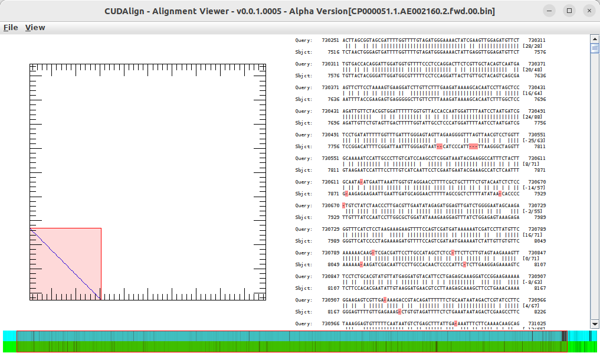

# MASA-Viewer

MASA-Viewer is a tool designed for visualizing alignment files generated by the MASA framework. It simplifies the process of analyzing sequence alignment results, providing a clear graphical user interface (Java GUI) for researchers and developers.

## Installation

Follow these steps to set up MASA-Viewer:

1. **Download the JAR File**:
   Download the `masa-viewer.jar` file from the repository.

2. **Ensure Java is Installed**:
   Make sure you have Java installed on your machine. You can verify by running:
   ```bash
   java -version
   ```

## Usage

1. Launch the application:

```bash
java -jar masa-viewer.jar
```

2. Load the .bin file containing the alignment data. There is a [sample folder](tree/main/sample) with .bin and .fasta files.
3. Load the corresponding FASTA file for each sequence.
   Note: The NCBI download feature is currently unavailable.
4. Explore and analyze the alignment data through the visual interface. You can select or drilldown the visualization (mouse scroll wheel).


## Screenshot

Here is an example of the MASA-Viewer interface:




